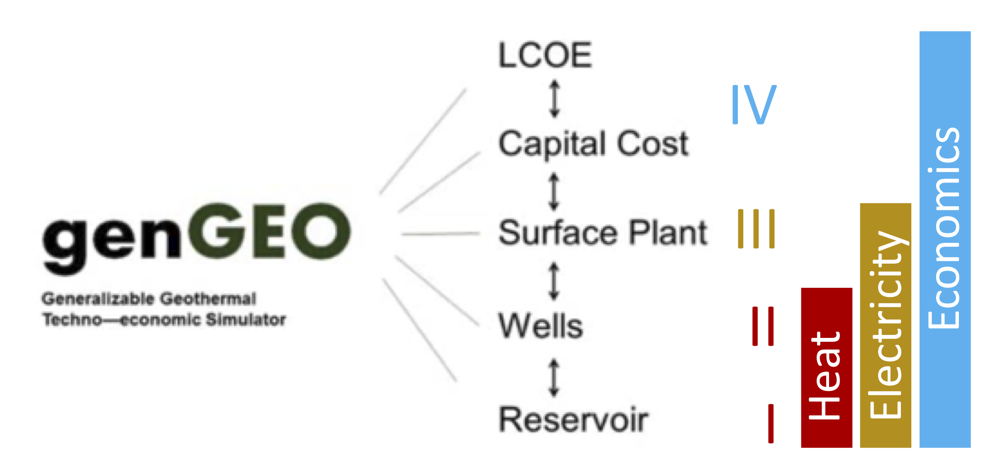

# genGEO

Generalizable Geothermal Techno-econmoic Simulator (or **genGEO**) is a coupled reservoir-electricity-cost geothermal simulator. It is an open-source, object-oriented python code which may be extended to include any geothermal or power generation scenario.

_(Example library used in the ["Document your project with Markdown, Sphinx, and Read the Docs"](https://github.com/readthedocs/tutorial-sphinx-markdown) tutorial)_
